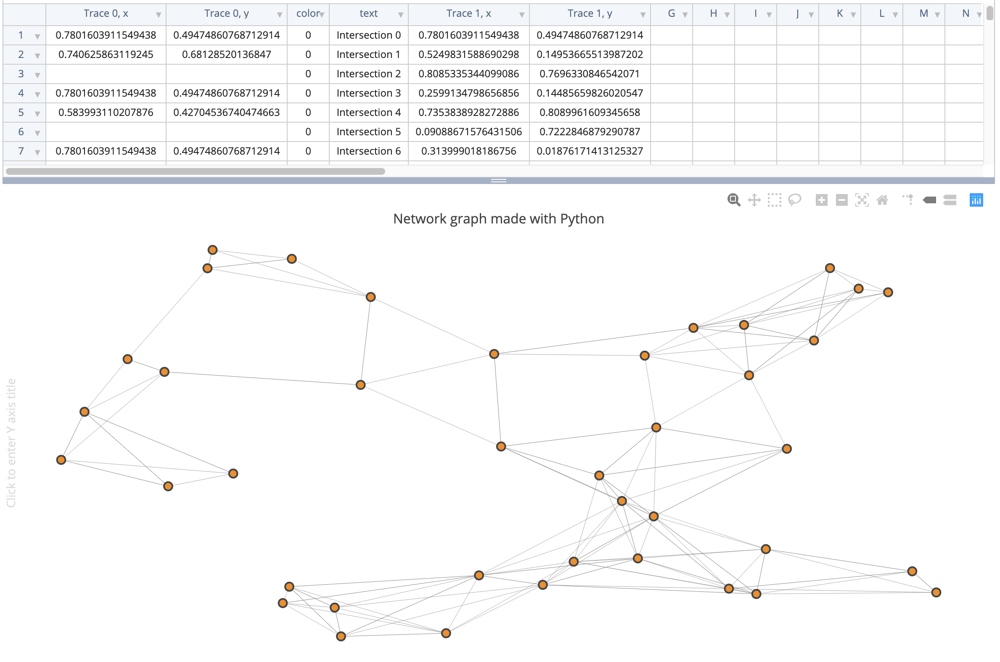
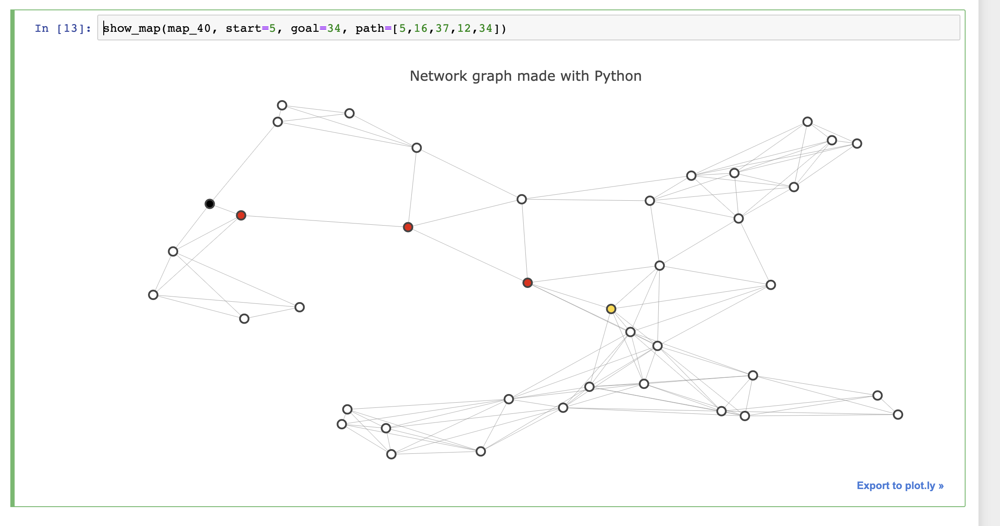

# Udacity-Project 3: Route Planner

Implement the _A Star Search Algorithm_ with a map already created using an adjacency list for nodes and object with x and y corrdinates for edges. 

## Getting Started
Researching the `a_star_search_algorithm` was fun and somewhat overwhelming as there are many different implementations and ways to approach logic. I'll come back and write more about this two week journey as I dived deep into graph algorithms. _more to follow shortly_

### Final Path Output

